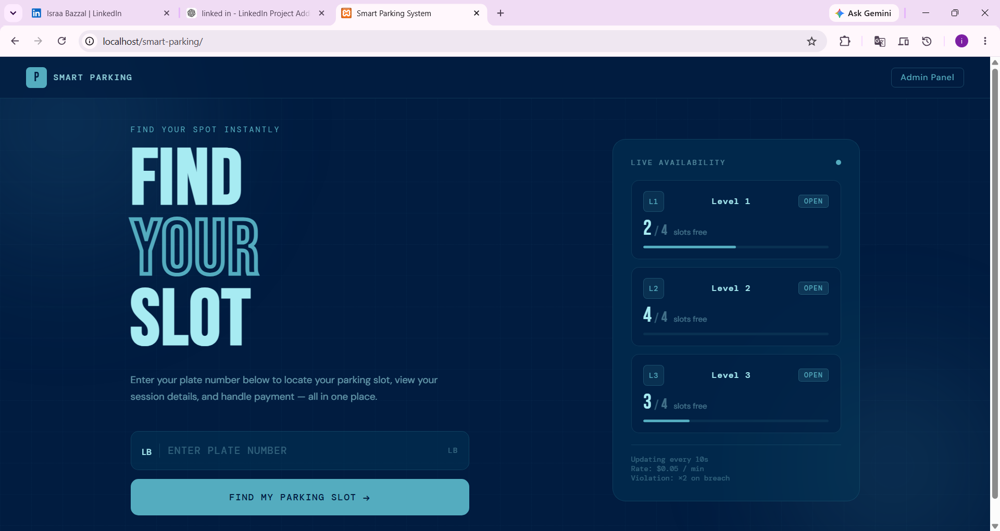
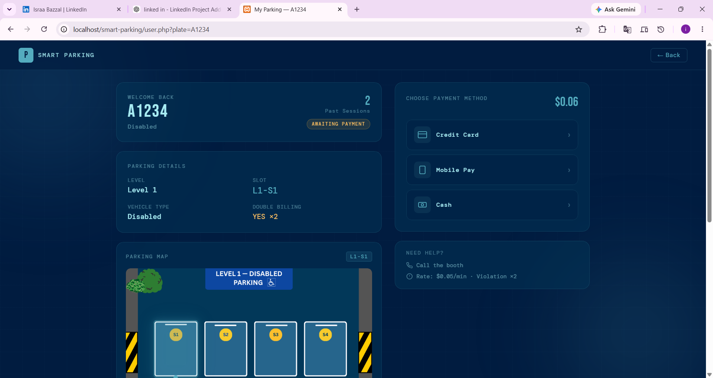
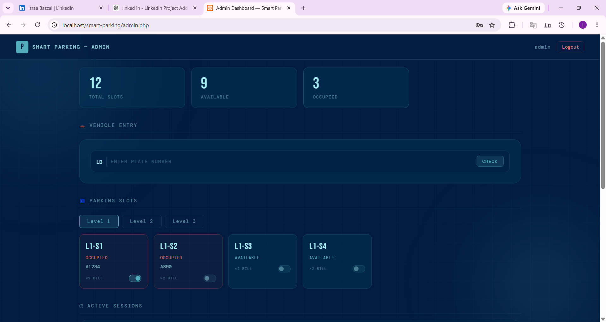
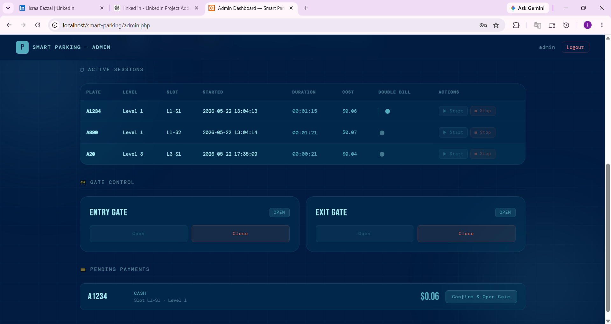
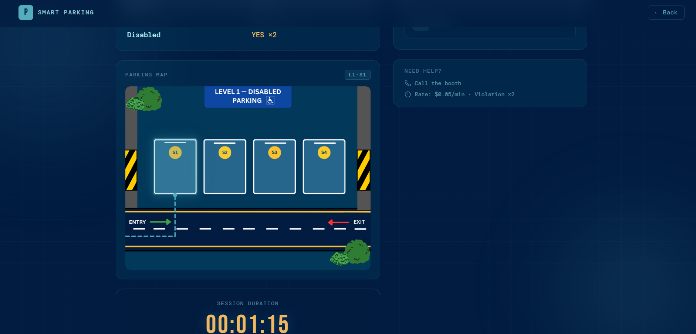
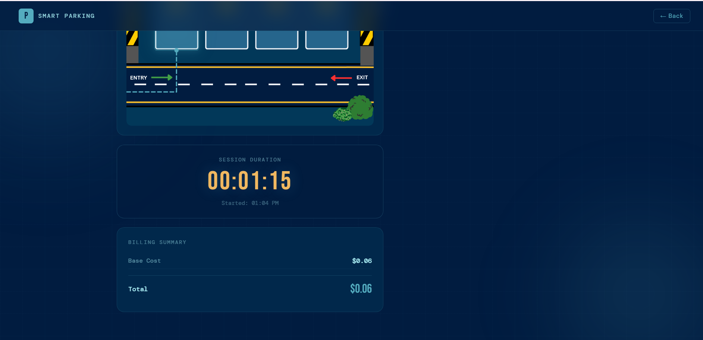

# 🚗 Smart Parking System


An **Embedded Smart Parking System** combining a **PHP/MySQL web application** with a **Proteus-based Arduino hardware simulation**. Vehicle owners locate their session using their license plate number, track their session and cost live, and pay through the web app, while a parking admin manages entry, gates, billing, and payments from a central dashboard. The hardware simulation models the physical side of the system — vehicle detection, slot occupancy, and automated gate control — using **Arduino Uno**, **ESP32-CAM**, IR/ultrasonic/TCRT sensors, servo motors, and a **Virtual Terminal**.

---

# 📖 Overview

The Smart Parking System is a full-stack Embedded Systems Design project built around two complementary components:

- A **PHP/MySQL web application** with three levels of 4 slots each (12 slots total). Vehicle owners find their session by entering their license plate number — there is no separate registration/login for users. Admins add vehicles, assign slots, run timers, control gates, and confirm payments through a dashboard.
- A **Proteus-based embedded simulation** that models vehicle detection, slot occupancy, and gate automation with an Arduino Uno. Since Proteus can't dynamically simulate IR beam-break and TCRT reflective sensors in real time, push buttons stand in for those sensors and trigger the same logic a real sensor would.

Parking data lives in the MySQL database and is managed through the web app; it is not automatically synced with the embedded simulation, which is a separate hardware demonstration.

---

# 🚀 Quick Start

1. Clone the repository.
2. Import the MySQL database (`database/smart_parking.sql`).
3. Place the project inside `xampp/htdocs`.
4. Start Apache and MySQL using XAMPP.
5. Open `http://localhost/smart-parking`.
6. Compile the Arduino sketch in Arduino IDE if you plan to run the Proteus simulation.

---

# ✨ Features

## 🎫 Plate-Based Session Lookup

- Entry page where vehicle owners find their session by license plate number — no registration or login required
- Live slot availability per level, refreshed every 10 seconds
- Interactive parking map that highlights the assigned slot and animates a navigation path from the entry point

## 🚘 Vehicle Detection (Hardware Simulation)

- Vehicle detection via IR sensors, simulated with push buttons in Proteus
- Parking slot occupancy monitoring using ultrasonic sensors (HC-SR04), one per slot
- Entry vehicle detection paired with a camera-indicator LED standing in for the ESP32-CAM
- Sensor readings and status shown through the Proteus Virtual Terminal

## 🚗 Billing & Double-Slot Parking

- Costs calculated automatically from session duration at a configurable rate (default $0.05/min)
- Double billing (×2) for vehicles occupying two adjacent slots, simulated in hardware via the TCRT sensor (represented by a push button)
- Violations are logged whenever double billing is applied and can be resolved by the admin

## 🚧 Automated Gate Control

- Entry gate opens automatically when the admin adds a vehicle
- Exit gate opens automatically once payment is confirmed
- Two servo motors control the gates in the hardware simulation
- Every gate event (who/what/when) is logged for auditing

## 📷 Camera Monitoring

- ESP32-CAM integration in the hardware design for entrance vehicle monitoring
- LED stand-in indicates when the "camera" is scanning a vehicle in the simulation

## 🅿 Parking Management

- 3 levels × 4 slots (12 total), each level with its own vehicle-type focus (e.g. Disabled, Small & Medium, Large)
- Real-time slot status (available/occupied) per level
- Automatic slot assignment when the admin adds a vehicle, based on vehicle type

## 💳 Payment Management

- Users submit a payment method (credit card, mobile pay, or cash) once their session ends
- Admin confirms payment, which frees the slot and triggers the exit gate
- Full payment history tied to each session

## 👨‍💼 Administrator Dashboard

Organized into six sections:
- Live stats bar (total / available / occupied slots)
- Vehicle entry panel with automatic slot assignment
- Parking slots grid with level tabs and real-time status
- Active sessions table with live timers and start/stop controls
- Gate control panel for manual entry/exit gate control
- Pending payments panel with a confirm action that triggers the exit gate

## 📊 Reports & Statistics

- Live occupancy statistics per level
- Active session tracking
- Payment and gate-event history

---

# 🛠 Key Technologies

**Frontend:** HTML5, CSS3 (dark blue glass-morphism theme), JavaScript, AJAX
**Backend:** PHP 8, MySQL, XAMPP
**Hardware:** Arduino IDE, Proteus Professional
**Tooling:** Visual Studio Code, phpMyAdmin, Google Fonts (Bebas Neue, DM Sans, DM Mono)

---

# 🔌 Hardware Components

- Arduino Uno
- ESP32-CAM
- IR Sensors (simulated via push buttons in Proteus)
- Ultrasonic Sensors (HC-SR04) — one per slot
- TCRT5000 Sensors (simulated via push button, for double-slot detection)
- Servo Motors (entry/exit gates)
- Virtual Terminal (Proteus)
- LEDs, Push Buttons

---

# ⚙️ System Architecture

## Embedded Layer
- Reads IR (button) and ultrasonic sensor inputs
- Detects vehicle movement and slot occupancy
- Controls entry and exit gate servos
- Displays sensor readings and status via the Proteus Virtual Terminal

## Database Layer
A MySQL database (`smart_parking`) with 10 linked tables:
- `admins` — admin login credentials
- `parking_levels` — the 3 levels and their status
- `parking_slots` — the 12 slots, level, type, status, double-billing flag
- `vehicles` — plate number and vehicle type, added automatically on first entry
- `parking_sessions` — one row per visit: timing, cost, billing, status
- `payments` — payment method, amount, status
- `gates` — current entry/exit gate status
- `gate_logs` — audit log of every gate event
- `billing_rates` — rate per minute and violation multiplier
- `violations` — records created when double billing is applied

## Web Application Layer

**Vehicle owners:**
- Find session by license plate
- Live session tracking (duration, cost, interactive map)
- Payment submission

**Administrators:**
- Dashboard (stats, vehicle entry, slots grid, sessions, gates, payments)
- Vehicle & session management
- Gate control
- Payment confirmation
- Reports & statistics

---

# 🚀 System Workflow

1. A vehicle owner arrives and enters their license plate at the entry page (or is added by the admin).
2. The admin adds the vehicle and assigns it to an available slot; the entry gate opens automatically.
3. The user page shows the live session timer, cost, and an animated map to the assigned slot.
4. The embedded simulation demonstrates the same flow physically: push buttons simulate IR/TCRT sensor triggers, ultrasonic sensors detect slot occupancy, and the ESP32-CAM stand-in LED activates on entry.
5. When the admin stops the timer, the total cost is calculated (with double billing applied if relevant).
6. The user submits a payment method; the admin confirms payment.
7. Confirming payment frees the slot, opens the exit gate, and logs the gate event.
8. The Proteus Virtual Terminal displays sensor readings, parking status, and billing information for the hardware demo in parallel.

---

# 📂 Project Structure

```text
SmartParkingSystem
│
├── api/                        # PHP API endpoints
├── css/                        # Stylesheets
├── js/                         # JavaScript files
├── image/                      # Images and UI assets
├── screenshots/                # Application screenshots
│
├── database/
│   └── smart_parking.sql
│
├── hardware/
│   └── Arduino/
│       └── SmartParkingSystem.ino
│
├── simulation/
│   └── SmartParkingSystem.pdsprj
│
├── proteus-libraries/
│   ├── ArduinoUnoTEP.IDX
│   ├── ArduinoUnoTEP.LIB
│   └── Ultrasonic Sensor Library for Proteus/
│
├── documentation/
│   └── Smart Parking System Report.pdf
│
├── admin.php
├── admin_login.php
├── index.php
├── user.php
│
├── README.md
└── .gitignore
```

---

# 🗄 Database

Import the SQL script before running the application:

```text
database/smart_parking.sql
```

See **System Architecture → Database Layer** above for the full table list.

---

# ⚙️ Installation

## 1. Clone the repository

```bash
git clone https://github.com/israaabazzal/SmartParkingSystem.git
```

## 2. Copy the project

```text
xampp/htdocs/
```

## 3. Import the database

Using **phpMyAdmin** or **MySQL Workbench**, import `database/smart_parking.sql`.

## 4. Configure the database connection

```php
$host = "localhost";
$user = "root";
$password = "";
$database = "smart_parking";
```

## 5. Start XAMPP

Start **Apache** and **MySQL** from the XAMPP Control Panel.

## 6. Run the application

```text
http://localhost/smart-parking
```

---

# 📸 Screenshots

<p align="center">
  
  
</p>

<p align="center">
  
  
</p>

<p align="center">
  
  
</p>

---

# 🔄 Hardware Simulation

The embedded hardware is implemented as a **Proteus Professional** simulation, controlled by an Arduino UNO.

The repository includes:
- Arduino source code
- Proteus simulation project
- Required Proteus libraries
- Project documentation

> **Note:** Compile the Arduino sketch in Arduino IDE to generate the HEX file before running the Proteus simulation.

The simulation demonstrates:
- Vehicle detection via push buttons standing in for IR beam-break and TCRT reflective sensors
- Slot occupancy detection using four ultrasonic sensors (one per slot)
- Automatic entry/exit gate control via servo motors
- An LED standing in for ESP32-CAM entry monitoring
- Double-slot occupancy detection and the corresponding adjusted billing, shown via the Virtual Terminal

---

# 📑 Documentation

Full project documentation is available in the **documentation** folder (**Smart Parking System Report.pdf**), covering:
- System requirements and objectives
- System architecture
- Hardware design (circuit description, Arduino code)
- Software implementation (HTML structure, CSS design, JavaScript, PHP backend)
- Database design
- Testing methodology
- Results, discussion, and future enhancements

---

# 📈 Future Enhancements

- Real hardware integration — replace simulated buttons with real IR, TCRT, and ultrasonic sensors on a physical Arduino, bridged to the web app (e.g. via ESP32 WiFi)
- Solar-powered hardware for energy-independent, outdoor-ready installations
- Secure password hashing for admin credentials (currently stored in plain text)
- Real payment gateway integration (e.g. Stripe, PayPal)
- Multiple admin accounts with role-based permissions
- Slot reservation system — let users reserve a slot in advance for a set time window
- Email/SMS notifications for timer stops, payment confirmation, and time-limit warnings
- Session history and reporting (revenue, peak hours, most-used slots)
- Dedicated mobile application

---

# 📌 Requirements

## Software
- PHP 8+
- MySQL
- XAMPP
- Arduino IDE
- Proteus Professional

## Hardware
- Arduino Uno
- ESP32-CAM
- IR Sensors
- Ultrasonic Sensors
- Servo Motors
- TCRT5000 Sensors
- Virtual Terminal (Proteus)

---

# 👨‍💻 Author

**Israa Bazzal**

Bachelor's Student in Computer and Communication Engineering

Developed as a group project for the Embedded Systems Design course (Faculty of Engineering, CCE Department), with Fatima Soumaka, Sarah Atat, and Haneen Baradie, supervised by Dr. Mohammad Chreif.

Passionate about Embedded Systems, IoT, Web Development, and Software Engineering.

---

# 📄 License

This project was developed as part of an Embedded Systems academic project and is intended for educational and demonstration purposes.
